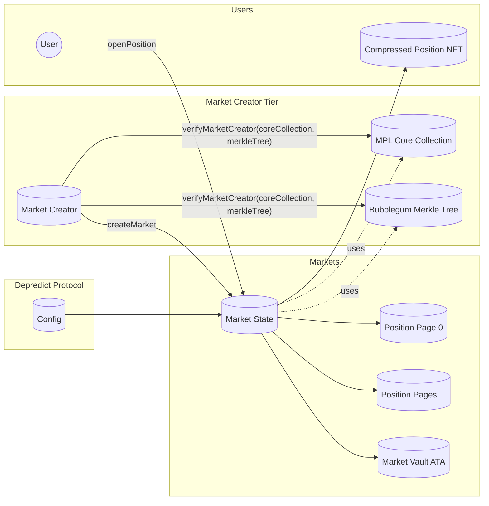
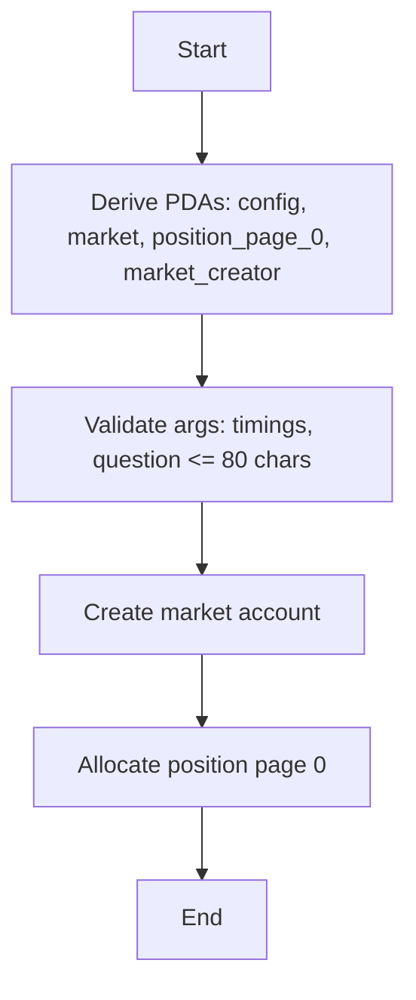
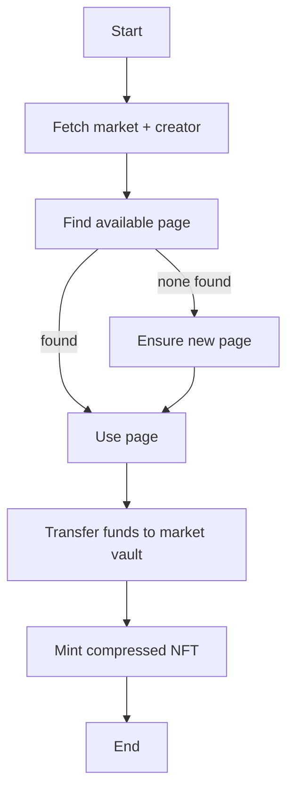
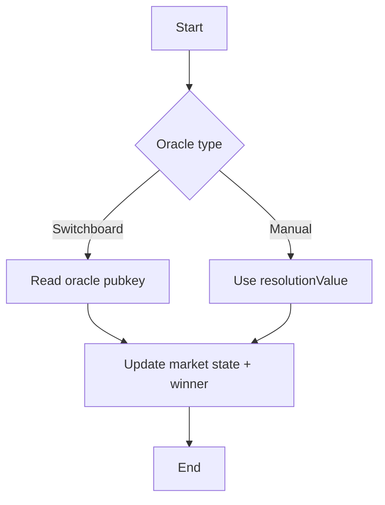
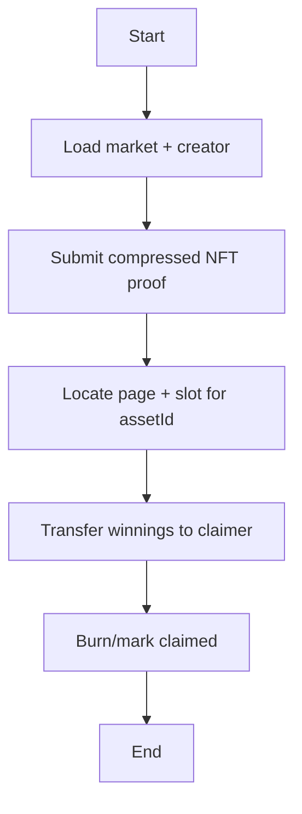

# Architecture & Technical Details

This page provides a detailed overview of the Depredict protocol's technical architecture and implementation.

---

## Protocol Overview

Depredict is built on Solana using the Anchor framework, with three main components:

1. **On-chain Program** (`programs/depredict/`): Rust smart contracts
2. **TypeScript SDK** (`sdk/`): Client library for protocol interaction
3. **Documentation** (`depredict-docs/`): Guides and API reference

---

## Smart Contract Architecture

### Core Accounts

#### Config Account
- **Purpose**: Protocol-wide configuration and fee management
- **Key Fields**:
  - `fee_amount`: Protocol fee in basis points
  - `authority`: Admin authority for config updates
  - `fee_vault`: Address to receive protocol fees
  - `next_market_id`: Auto-incrementing market ID

#### Market State Account
- **Purpose**: Individual market data and state
- **Key Fields**:
  - `market_id`: Unique market identifier
  - `question`: Market question (max 80 characters)
  - `market_start/end`: Market timing
  - `betting_start`: When trading begins (for future markets)
  - `oracle_type`: Switchboard or manual resolution
  - `market_type`: Live or future market
  - `yes_liquidity/no_liquidity`: Current liquidity pools
  - `pages_allocated`: Number of allocated position pages
  - `mint` and `decimals`: Token used for trading and its decimals
  - `market_vault`: Vault address holding market funds

#### Market Creator Account
- **Purpose**: Represents a platform/team that creates markets. Holds NFT collection and merkle tree references used for positions.
- **Key Fields**:
  - `name`: Display name of the market creator
  - `creator_fee_bps`: Creator fee in basis points (max capped in program)
  - `fee_vault`: Creator fee vault
  - `core_collection`: MPL Core collection used for position NFTs
  - `merkle_tree`: Bubblegum compression tree for scalable minting

#### Position Pages
- **Purpose**: Scalable, paged storage of positions per market to support high throughput.
- **Details**:
  - Each market has multiple `position_page` accounts, with fixed slots (e.g., 16 entries per page)
  - New pages are created on-demand and may be pre-warmed when capacity is low
  - SDK auto-discovers or creates a page with available slots when opening a position

#### Position NFT
- **Purpose**: Individual position representation
- **Implementation**: MPL Core NFT (compressed), minted at position open and burned at settlement
- **Key Fields**:
  - `position_id`: Unique position identifier
  - `direction`: YES or NO position
  - `amount`: Position size
  - `status`: OPEN, WAITING, SETTLED, etc.

### Account Relationships (Diagram)



---

## Market Types

### Live Markets
- **Start**: Trading begins immediately when market is created
- **Use Case**: Real-time events, breaking news, etc.

### Future Markets
- **Start**: Trading begins at a specified future time
- **Use Case**: Scheduled events, elections, etc.

For broader categories like binary, multi-outcome, scalar, and tournament markets, see [Market Types](/market-types).

---

## Oracle Integration

### Switchboard Oracle
- **Usage**: Automated, decentralized resolution
- **Cost**: ~$0.15 per resolution
- **Setup**: Requires oracle pubkey during market creation

### Manual Resolution
- **Usage**: Admin-controlled resolution
- **Cost**: Gas fees only
- **Process**: Admin calls `resolveMarket` with outcome

---

## Instruction Flows

### Create Market
0. Precondition: The `market_creator` must be verified with a valid MPL Core collection and Bubblegum merkle tree
1. Derive PDAs for `config`, `market`, `position_page_0`, and `market_creator` (from payer)
2. Initialize market with question, timings, market type, oracle type, and mint/decimals
3. Allocate first position page

SDK: `client.trade.createMarket({ question, startTime, endTime, oracleType, marketType, bettingStartTime?, metadataUri, payer })`



### Open Position
1. Fetch market and its mint, market vault, and market creator
2. Find or create a position page with available slots
3. Mint a compressed MPL Core NFT representing the position
4. Transfer funds into the market vault

SDK: `client.trade.openPosition({ marketId, amount, direction, payer, metadataUri })`



### Resolve Market
1. If manual, pass resolution value; if oracle-driven, read Switchboard result
2. Update market state and winning direction

SDK: `client.trade.resolveMarket({ marketId, payer, resolutionValue? })`



### Settle Position (Payout)
1. Provide compressed NFT proof (root, hashes, nonce, index)
2. Burn/mark position as claimed and transfer winnings to claimer

SDK: `client.trade.payoutPosition({ marketId, payer, assetId })`



### Close Market
1. Collect protocol and creator fees
2. Close market accounts and vaults

SDK: `client.trade.closeMarket(marketId, payer)`

---

## Token Integration

### Automatic Token Swapping (coming soon)
- **Planned**: Trade with any SPL token
- **Planned flow**: Convert user token to market mint via Jupiter aggregator
- **Current behavior**: Users must pay with the market mint; ensure the user's ATA for the market mint is funded

### Fee Structure
- **Protocol Fee**: Configurable percentage of trade volume
- **Oracle Fee**: Per-resolution cost for Switchboard markets
- **NFT Minting**: ~0.002 SOL per position

---

## Position Management

### NFT-Powered Positions
- **Technology**: MPL Core for NFT minting
- **Benefits**:
  - True ownership and transferability
  - Secondary market trading
  - Composability with other protocols

### Position Lifecycle
1. **Creation**: User opens position, NFT is minted
2. **Trading**: Position can be transferred or held
3. **Resolution**: Market outcome determines position value
4. **Settlement**: User claims payout by burning NFT

### Sub-Position Accounts
- **Purpose**: Handle multiple positions per user per market
- **Implementation**: Hierarchical account structure
- **Benefits**: Efficient storage and gas optimization

---

## Security Features

### Access Control
- **Config Authority**: Controls protocol parameters
- **Market Authority**: Controls individual market settings
- **Position Authority**: Controls individual positions

### Validation
- **Market State**: Prevents invalid state transitions
- **Timing**: Enforces market start/end times
- **Liquidity**: Ensures sufficient liquidity for trades

### Error Handling
- **Custom Errors**: Specific error types for different scenarios
- **Graceful Degradation**: Markets can be paused or closed
- **Recovery Mechanisms**: Admin tools for emergency situations

---

## Performance Considerations

### Gas Optimization
- **PDA Usage**: Program-derived addresses for deterministic account creation
- **Batch Operations**: Multiple operations in single transaction
- **Account Reuse**: Efficient account structure design

### Scalability
- **Parallel Processing**: Solana's concurrent transaction processing
- **State Management**: Efficient account state updates
- **Memory Usage**: Optimized data structures

---

## Development Workflow

### Local Development
```bash
# Build program
anchor build

# Run tests
anchor run test-runner-continue

# Deploy to localnet
anchor deploy
```

### SDK Development
```bash
cd sdk
yarn install
yarn build
```

### Documentation
```bash
cd depredict-docs
yarn install
yarn dev
```

---

## Integration Points

### External Protocols
- **Jupiter**: Token swapping and aggregation
- **Switchboard**: Oracle data feeds
- **MPL Core**: NFT minting and management

### Developer Tools
- **Anchor**: Framework for Solana development
- **TypeScript**: SDK and tooling
- **Vocs**: Documentation site generation

---

This architecture provides a robust, scalable foundation for decentralized prediction markets while maintaining security, performance, and developer experience. 